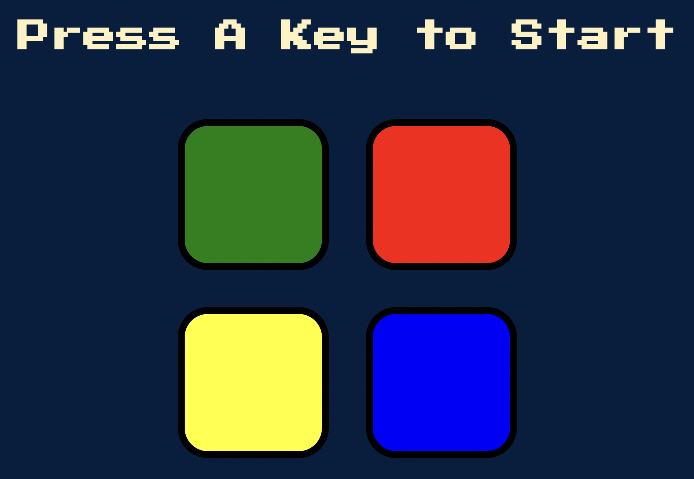

# The Simon Game
### How to play the classic game

- The game consists of a series of flashing lights and sounds, which the player must repeat in the correct order.

- The game starts with a single light flashing, and the player must repeat the sequence by pressing the corresponding button.

- Each time the player successfully repeats the sequence, the game adds another step to the sequence, making it longer and more challenging.

- The player must repeat the sequence correctly to advance.

- If the player makes a mistake, the game will end, and the player must start again from the beginning.

- The game gets progressively harder, with the sequence getting longer. The objective is to see how far the player can get without making a mistake.

- The buttons on the Simon game are labeled with different colors, and each color corresponds to a different sound. The player must watch and listen carefully to remember the sequence of lights and sounds.

- Have fun and challenge yourself to see how far you can get!

## Developer Notes

    Step 1 - Add Javascript and jQuery
    Step 2 - Create A New Pattern
    Step 3 - Show the Sequence to the User with Animations and Sounds
    Step 4 - Check Which Button is Pressed
    Step 5 - Add Sounds to Button Clicks
    Step 6 - Add Animations to User Clicks
    Step 7 - Start the Game
    Step 8 - Check the User's Answer Against the Game Sequence
    Step 9 - Game Over
    Step 10 - Restart the Game

### Screenshot

### Acknowledgements
Twitter @yu_angela

